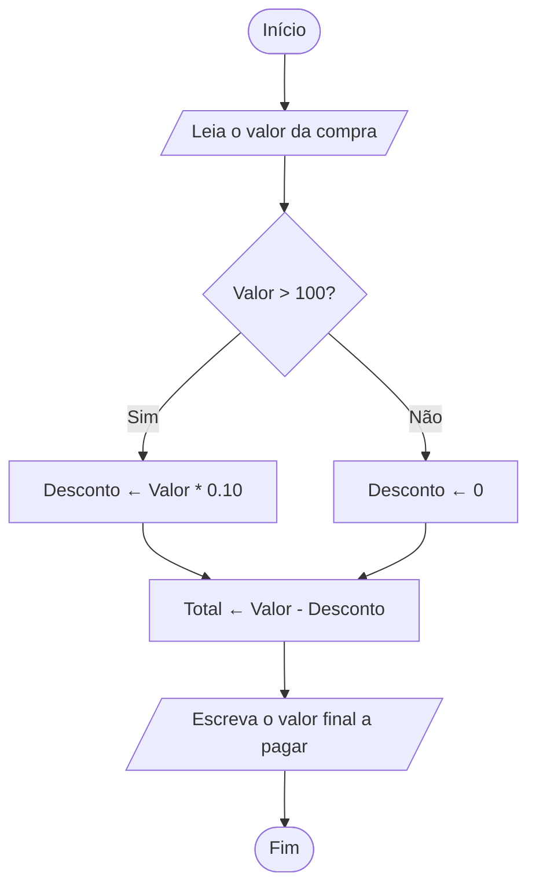

```mermaid
flowchart TD
    Inicio([Início]) --> LerValor[/Leia o valor da compra/]

    LerValor --> Decisao{Valor > 100?}

    Decisao -- Sim --> CalcularDesconto[Desconto ← Valor * 0.10]
    Decisao -- Não --> SemDesconto[Desconto ← 0]

    CalcularDesconto --> CalcularTotal[Total ← Valor - Desconto]
    SemDesconto --> CalcularTotal

    CalcularTotal --> MostrarTotal[/Escreva o valor final a pagar/]
    MostrarTotal --> Fim([Fim])
```